# Telegram Inventory Automation Bot
Laravel-based Telegram Bot for Inventory Management using Webhook Integration.

## 📌 Deskripsi Project
Telegram Inventory Automation Bot adalah sistem otomatisasi pengelolaan stok barang berbasis Telegram Bot yang dikembangkan menggunakan Laravel. Sistem ini memungkinkan admin untuk melakukan update stok, melihat data inventory, serta mencatat transaksi masuk dan keluar secara real-time melalui Telegram.

Bot ini diintegrasikan menggunakan Telegram Bot API dengan metode webhook untuk memastikan komunikasi data berlangsung cepat dan efisien.

Project ini dikembangkan sebagai bagian dari internship.

---

## 🛠 Tech Stack
- PHP 8+
- Laravel
- MySQL
- Telegram Bot API
- Webhook Integration
- Eloquent ORM
- RESTful Architecture

---

## ⚙️ Cara Instalasi

1️⃣ Clone repository
```bash
git clone https://github.com/auroralph/inventory-telegram-bot.git
```
2️⃣ Masuk ke folder project
```bash
cd inventory-telegram-bot
```
3️⃣ Install dependency
```bash
composer install
```
4️⃣ Copy file environment
```bash
cp .env.example .env
```
5️⃣ Generate app key
```bash
php artisan key:generate
```
6️⃣ Konfigurasi database di file `.env`

7️⃣ Jalankan migration
```bash
php artisan migrate
```

##  ▶️ Cara Menjalankan Project

Jalankan server lokal:
```bash
php artisan serve
```
Pastikan webhook sudah di-set pada Telegram Bot API ke endpoint:
```bash
https://your-domain.com/api/webhook
```

## 🏗 System Architecture
- MVC Pattern (Laravel)
- RESTful API Endpoint
- Webhook-based Communication
- Role-based Validation
- Database Transaction Logging

## 📷 Screenshot
### Tampilan Semua Perintah Bot
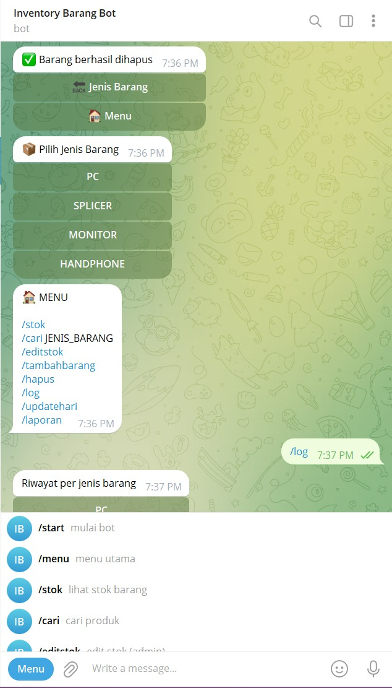
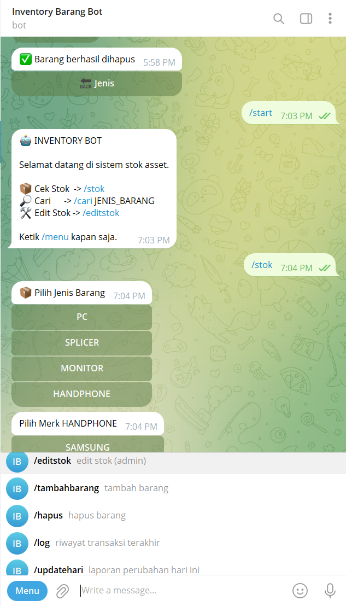
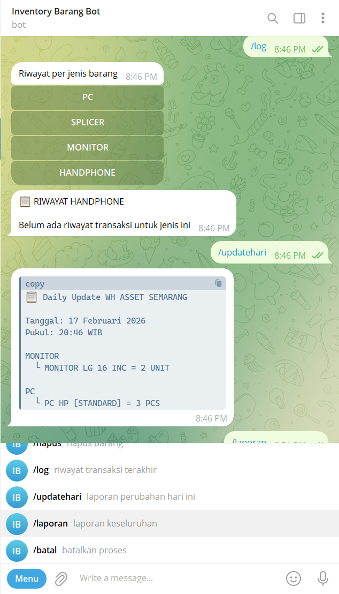

### Perintah Dijalankan
`/start`
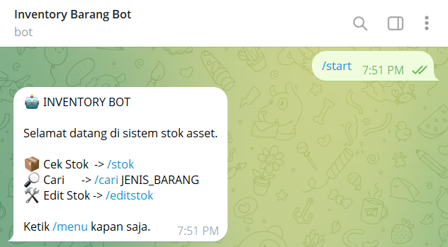

### Perintah dan Button Dijalankan
`/stok`
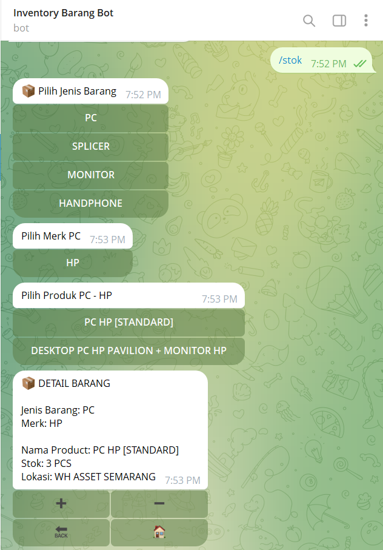

`🔙` 


`🏠`


### Perintah Dijalankan
`/cari nama_product`
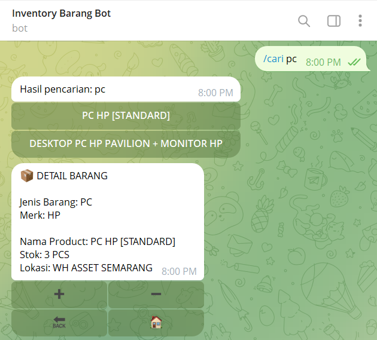

### Perintah dan Button Dijalankan
`/editstok`
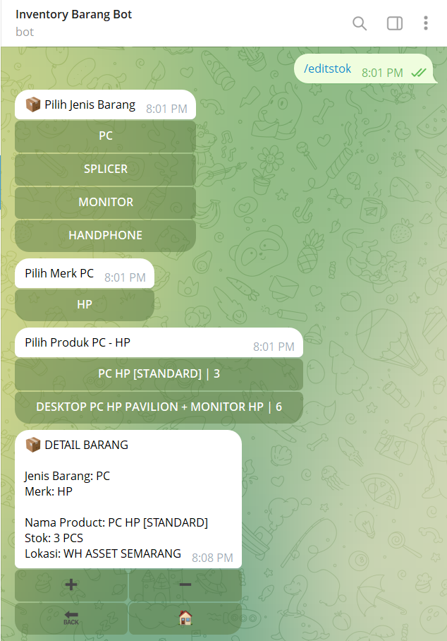

`➕`
`➖`
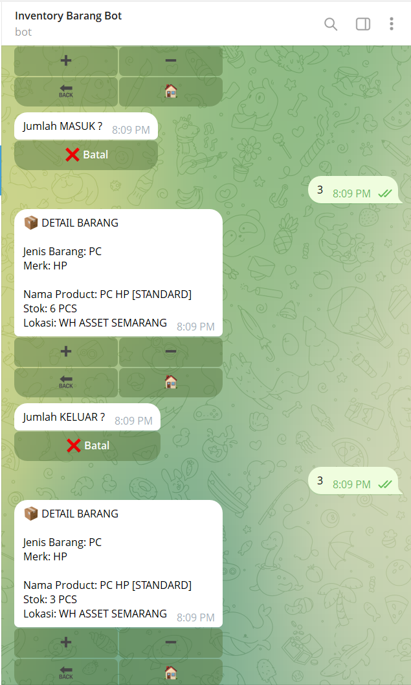

`🔙` 
`🏠`


### Perintah dan Button Dijalankan
`/tambahbarang`
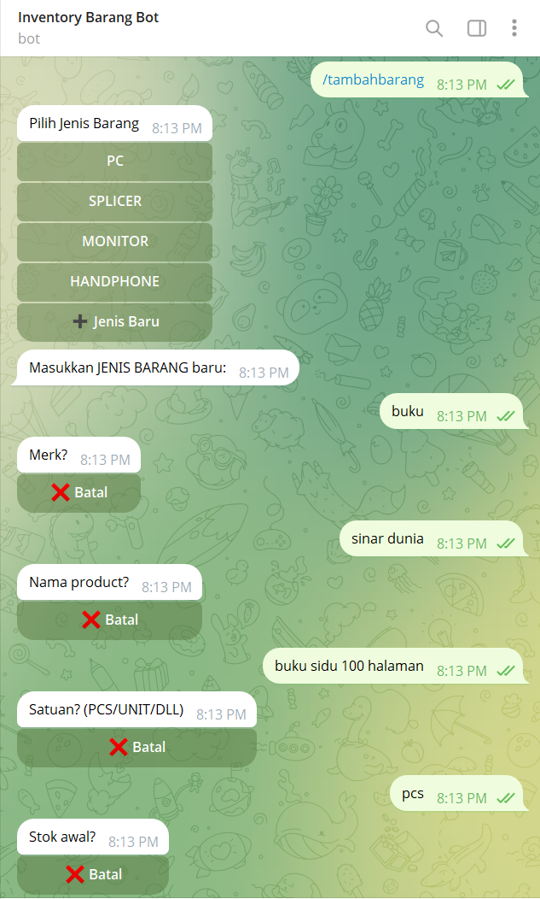
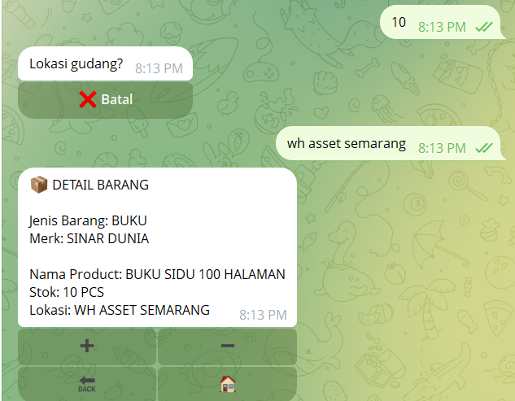

`🔙` 
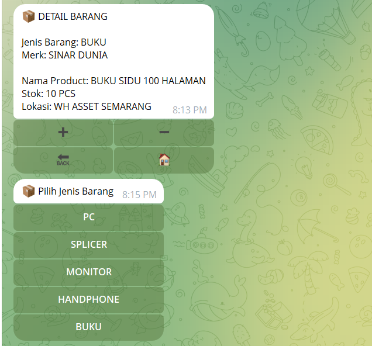

### Perintah Dijalankan
`/hapus`
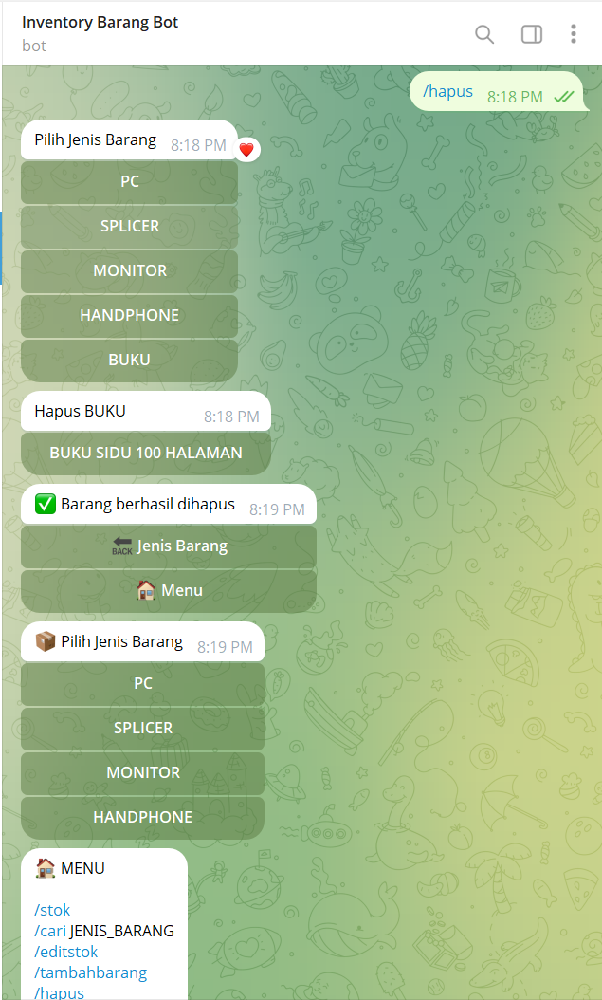

### Perintah Dijalankan
`/log`
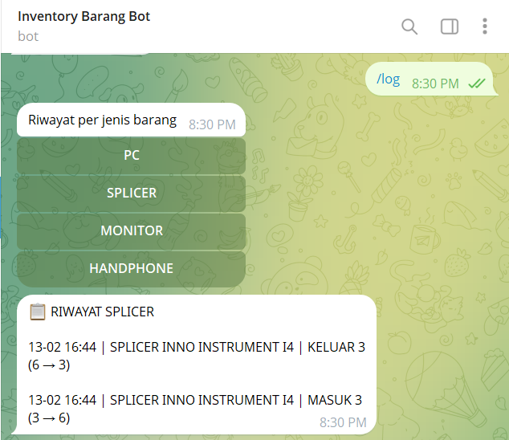
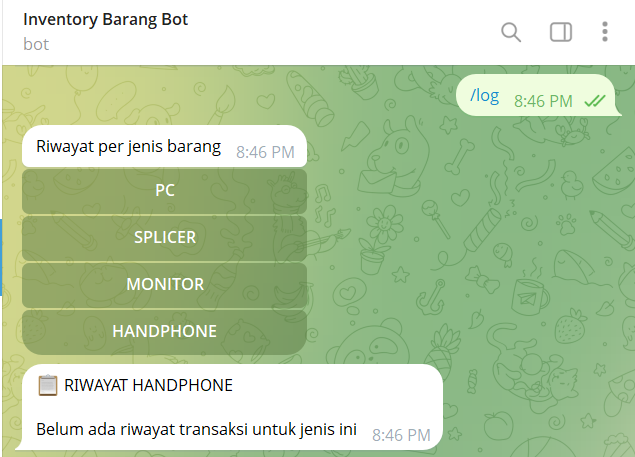

### Perintah Dijalankan
`/updatehari`
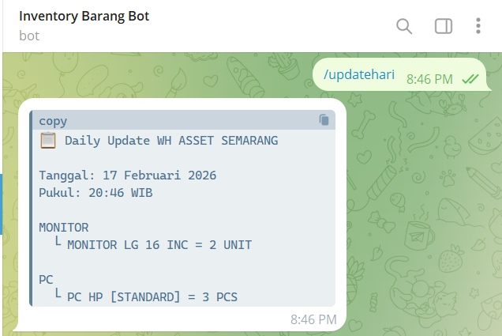

### Perintah dan Button Dijalankan
`/laporan`
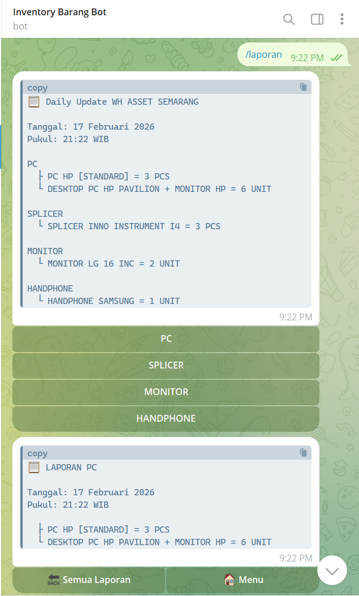

`🔙 Semua Laporan`
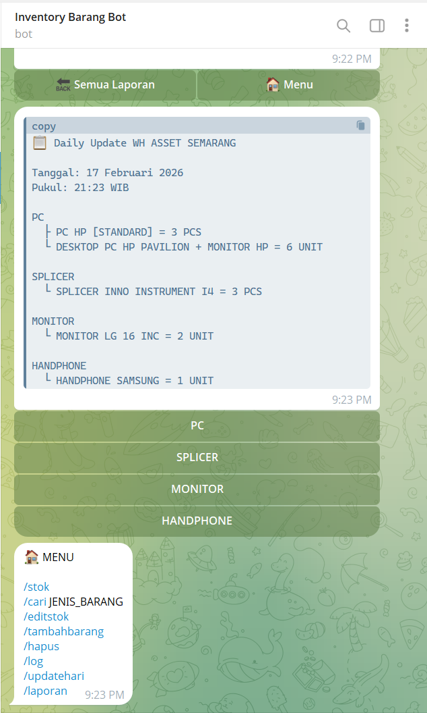

##  📁 Struktur Folder (Ringkas)
```bash
app/
 ├── Http/
 │    ├── Controllers/
 │    ├── Middleware/
 ├── Models/
database/
routes/
 ├── api.php
 ├── web.php
```

 ##  ✨ Fitur Utama
- Update stok barang
- Cek stok real-time
- Validasi input user
- Logging transaksi
- Integrasi webhook Telegram
